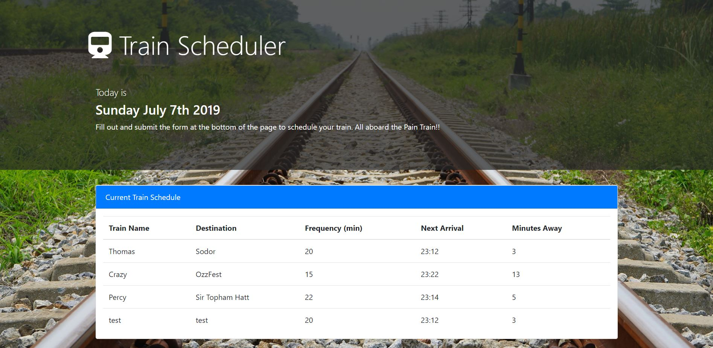

# TrainScheduler
A train schedule that stores input in Firebase and shows train arrival times.

## Contributors
@boogeybum

## Technology
* Bootstrap, HTML5, CSS, JavaScript, jQuery, Firebase
* Live demo: https://boogeybum.github.io/TrainScheduler/

## About
* Utilizing Firebase for the database, this form saves the data input into the form by the user and then retrieves the data from firebase and adds the data to the schedule table. Based on the train start time and frequency it calculates the time of the next arrival and the minutes remaining until that arrival and also displays these values in the html document. 

## License 
* No license explicite or implied.

## How-to use this code
* In a web browser, fill out the form with according to the labels and submit to the database. 

## Contributing Guidelines
All contributions and suggestions are welcome!
For direct contributions, please fork the repository and file a pull request. 

## Contact
#### Developer/Full-stack Web Software Developer (in training)
* Homepage: https://boogeybum.github.io/Bootstrap-Portfolio/
* e-mail: cseastrand@gmail.com
* Twitter: @cseastrand
* LinkedIn: https://www.linkedin.com/in/clayton-seastrand-43a76861/
